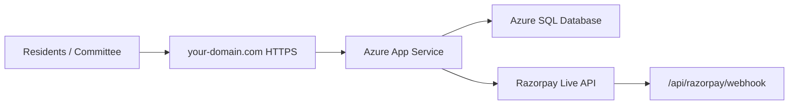

# Publish Apartment Management System on Azure

This guide is the recommended path for your app (.NET + SQL Server + Razorpay).

## Recommendation: domain + Azure

| Piece | Suggestion | Why |
|-------|------------|-----|
| **Hosting** | **Azure App Service** (Windows or Linux) | Built for ASP.NET Core, HTTPS, easy deploy |
| **Database** | **Azure SQL Database** | Same engine as your app; no opening your home PC SQL to the internet |
| **Domain** | Buy from **GoDaddy / Namecheap / Google Domains** (~₹800–1200/year) | e.g. `marvelrocks.in` or `marvelrockspayments.com` |
| **DNS** | Point domain to App Service (Azure gives free SSL) | Razorpay and residents need HTTPS |

**Do not** expose your local SQL Server (`ATCHYUT2026\...`) to the public internet.

**Alternatives (cheaper, more manual):** VPS (Hostinger, DigitalOcean) + IIS — fine if you are comfortable server admin.

---

## Rough monthly cost (India / pay-as-you-go)

| Resource | Tier | Approx. |
|----------|------|---------|
| App Service | B1 Basic | ~₹1,000–1,300/mo |
| Azure SQL | Basic (2 GB) | ~₹400–800/mo |
| Domain | .in / .com | ~₹80–100/mo (yearly lump) |
| **Total** | | **~₹1,500–2,200/mo** |

Use **Test** Razorpay until go-live; no payment gateway hosting fee.

---

## Free Azure account (testing first — recommended)

**Yes — use your free account to validate everything**, then upgrade to a paid plan when residents will use it daily.

### What works well on free / credit

| Item | Free / trial approach |
|------|------------------------|
| **Web app** | App Service **F1 (Free)** or **B1** using $200 new-account credit |
| **URL** | `https://yourapp.azurewebsites.net` (HTTPS included) — enough for **Razorpay test** keys |
| **Database** | Azure SQL **Basic** or offer included in free account / 30-day credit |
| **Razorpay** | Keep **test** keys (`rzp_test_...`) until you upgrade hosting |
| **Domain** | **Skip for now** — use `*.azurewebsites.net` for testing |

### Free tier limitations (know before you rely on it)

| Limitation | Impact |
|------------|--------|
| **F1 app sleeps** | First visit after idle may be slow (cold start) |
| **No Always On** on F1 | Background payment reminders may not run 24/7 |
| **Custom domain + managed cert** | Usually needs **Basic (B1)** or higher |
| **.NET 10 runtime** | Confirm stack in portal; if missing, pick latest .NET or publish self-contained |
| **SQL size / DTU** | Fine for one society; monitor usage |

### Suggested testing path

1. Deploy app + Azure SQL on **free / credit** (follow steps below).
2. Set `Application__AppUrl` = `https://YOURAPP.azurewebsites.net`.
3. Configure **Razorpay test** keys in App Service settings (not live).
4. Test login, payment, receipt, collection dashboard with committee.
5. If all good → upgrade App Service to **B1**, SQL to **Basic**, buy **domain**, switch Razorpay to **live**.

### Avoid surprise bills

- In portal: **Cost Management → Budgets** → alert at ₹500 / ₹1000.
- Use **same resource group** `rg-marvelrocks-test` so you can delete everything easily.
- After trial, **delete** unused resources or upgrade deliberately — don’t leave credit expired resources on expensive SKUs.

### When to move to paid subscription

- Real residents paying with **live** Razorpay
- Custom domain (e.g. `payments.marvelrocks.in`)
- 24/7 uptime and scheduled SMS/email reminders
- More than ~50–100 active users daily

---

## Architecture



---

## Step 1 — Azure resources

1. Sign in: [https://portal.azure.com](https://portal.azure.com)
2. **Create a resource** → **SQL Database**
   - Resource group: `rg-marvelrocks` (new)
   - Database name: `ApartmentManagementDB`
   - Server: new SQL server, strong admin password, region **Central India**
   - Compute: Basic (upgrade later if needed)
3. **Create a resource** → **Web App**
   - Name: e.g. `marvelrocks-ams` (must be globally unique)
   - Publish: **Code**
   - Runtime: **.NET 10** (or latest .NET available; if missing, use Linux + container or self-contained publish)
   - Region: **Central India**
   - Plan: **B1** or free F1 for short trial only

4. SQL firewall: allow **Azure services**; add your IP for SSMS access during migration.

---

## Step 2 — Move database to Azure SQL

On your PC (with current data):

```powershell
# Export from local SQL (adjust server/database names)
# Use SSMS: Right-click database → Tasks → Deploy Database to Microsoft Azure SQL Database
# Or: Tasks → Export Data-tier Application (.bacpac) then Import on Azure SQL
```

After import, set App Service connection string (Step 3).

First deploy only: set application setting:

`DATABASE_MIGRATE_ON_STARTUP` = `true`

After the site runs once successfully, set it to `false` (or remove).

---

## Step 3 — Configure App Service (secrets)

**Configuration → Application settings** — use `deploy/azure-app-settings.template.json` as a checklist.

Minimum:

| Setting | Example |
|---------|---------|
| `ASPNETCORE_ENVIRONMENT` | `Production` |
| `ConnectionStrings__DefaultConnection` | Azure SQL connection string |
| `Application__AppUrl` | `https://your-domain.com` |
| `Payment__Provider` | `Razorpay` |
| `Payment__Razorpay__KeyId` | `rzp_live_...` (when live) |
| `Payment__Razorpay__KeySecret` | (secret) |
| `DATABASE_MIGRATE_ON_STARTUP` | `true` (first run only) |

Use **Azure App Settings**, not `integrations.local.json` in production (file may be lost on redeploy).

**Configuration → General settings → HTTPS Only** = On.

---

## Step 4 — Deploy the app

From project folder:

```powershell
.\scripts\Publish-Azure.ps1
```

Upload `deploy/apartment-app.zip`:

- Portal → App Service → **Deployment Center** → ZIP deploy  
  **or**
- Visual Studio: Publish → Azure → select Web App

Verify: open `https://marvelrocks-ams.azurewebsites.net/health` → should return `healthy`.

---

## Step 5 — Custom domain (login URL)

**Full guide:** [CUSTOM-DOMAIN.md](./CUSTOM-DOMAIN.md)

Short version:

1. Buy domain (e.g. `marvelrocks.in`).
2. App Service → **Custom domains** → Add `portal.marvelrocks.in`.
3. At registrar, add DNS records Azure shows (usually **CNAME** + **TXT** verify).
4. Managed certificate: **Add binding** → App Service Managed Certificate (free HTTPS).
5. Set `Application__AppUrl` = `https://portal.marvelrocks.in` → **Restart**.
6. Share `https://portal.marvelrocks.in/Account/Login` with committee and residents.

Public pages for Razorpay review:

- `https://your-domain/Home/Public`
- `https://your-domain/Home/Privacy`
- `https://your-domain/Home/Terms`
- `https://your-domain/Home/Refund`

---

## Step 6 — Razorpay live

1. Complete Razorpay **KYC** and add society **bank account**.
2. Switch to **Live** API keys in App Service settings.
3. Razorpay → Website URL = your public `/Home/Public` URL.
4. Webhook: `https://your-domain/api/razorpay/webhook`, event `payment.captured`, secret in `Payment__Razorpay__WebhookSecret`.

---

## Step 7 — Smoke test

- [ ] `/health` OK  
- [ ] Login as Admin, change password from default  
- [ ] Resident login + test payment (live small amount)  
- [ ] Receipt PDF downloads  
- [ ] Collection dashboard loads  

---

## Security checklist

See also **[PRODUCTION-HARDENING.md](./PRODUCTION-HARDENING.md)**.

- [ ] `Identity__ResetAndSeedAdminOnStartup` = **false** in production  
- [ ] Strong SQL password; firewall restricted  
- [ ] Azure SQL **point-in-time backup** enabled  
- [ ] `Application__AppUrl` = your **custom domain**  
- [ ] No secrets in git (`integrations.local.json` stays local)  
- [ ] Change default **Admin** password on first login  
- [ ] Application Insights connection string (optional)  

---

## Troubleshooting

| Issue | Fix |
|-------|-----|
| 500 on startup | Check Log stream; connection string; run migrations once |
| Razorpay webhook fails | HTTPS URL must be public; verify webhook secret |
| Wrong links in email | Set `Application__AppUrl` to final domain |
| .NET 10 not on App Service | Publish self-contained or use Windows plan with latest runtime stack |

---

## What you do manually (cannot be automated from code)

1. Create Azure subscription and resources  
2. Purchase domain  
3. Pay Azure bills  
4. Razorpay KYC and live keys  

Use this doc and `scripts/Publish-Azure.ps1` when those are ready.
